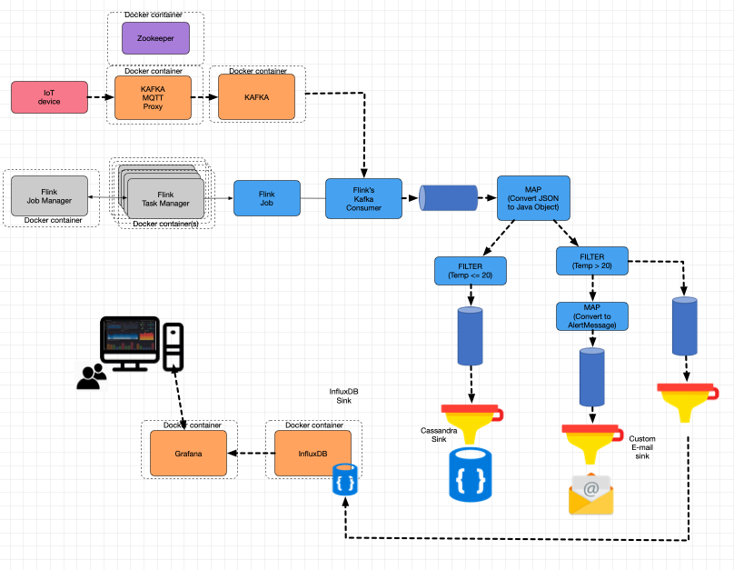

### Software Engineering for IoT and BigData
### Lab 5 - Time series persistence and dashboards


In Lab-04, you created a n IoT data streaming pipeline, which ended in a Flink job that filtered, mapped and routed the data: high temperatures readings ended as email alert messages, and low temperatures were stored in a cassandra database.

In this exercise, you will complete the data streaming pipeline with the integration of a dashboard built with [Grafana](https://grafana.com/), as depicted in the diagram below. To do so you will:

1. Add an extra Sink to Flink's job, so high temperature readings are stored in an InfluxDB time-series database.
2. Configure a Dashboard in Grafana, so it pulls data from the said time-series database.




1. Add [InfluxDB](https://hub.docker.com/_/influxdb) and [Grafana](https://hub.docker.com/r/grafana/grafana/) services to the current Docker-compose configuration:

	```
	influxdb:
    	  image: influxdb:latest
    	  container_name: influxdb
    	  hostname: influxdb
    	  ports:
      	    - "8083:8083"
      	    - "8086:8086"
      	    - "8090:8090"
    	  environment: 
      	    INFLUXDB_DATA_ENGINE: tsm1
      	    INFLUXDB_REPORTING_DISABLED: 'false'
    	  volumes:
      	    - ./influxdb-data:/var/lib/influxdb
	```

	```
  	grafana:
	  image: grafana/grafana:latest
   	  container_name: grafana
    	  hostname: grafana
    	  ports:
      	    - "3000:3000"
    	  environment: 
      	    GF_INSTALL_PLUGINS: grafana-clock-panel,briangann-gauge-panel,natel-plotly-panel,grafana-simple-json-datasource
    	  user: "0"
    	  links:
      	    - influxdb
    	  volumes:
      	    - ./grafana-data:/var/lib/grafana
	```

2. Once the services are up and running, open an InfluxDB client on the influxdb container, as described on [its documentation](https://docs.influxdata.com/influxdb/v1.8/introduction/get-started/). Once there, create a database to store the data time series recevied from Flink.

3. Flink doesn't have an out-of-the-box data Sink for InfluxDB, so you will create one. To do so, create a subclass of the [RichSinkFunction class](https://ci.apache.org/projects/flink/flink-docs-release-1.9/api/java/org/apache/flink/streaming/api/functions/sink/RichSinkFunction.html) (as you did in Lab-04). InfluxDB, as a time-series database, store 'data points' which, by default have a timestamp associated, and a series of measurements (in this case, just a temperature reading). Consequently, override the _open_, _invoke_ and _close_ methods using the [Influxdb-java API](https://github.com/influxdata/influxdb-java), as follows:

	- *open*: open a connection to the InfluxDB instance in the 'influxdb' service. 
	- *invoke*: create a Point using the device identifier as the measurement-id, and add a field 'temperature', with the value recevied from the topic. Write the point to the database created in step 2.
	- *close*: close the connection to the database.

	To use InfluxDB Java API, add the following dependency to the maven configuration of the Flink's job project:
	
	```xml
		<dependency>
			<groupId>org.influxdb</groupId>
			<artifactId>influxdb-java</artifactId>
			<version>2.20</version>
		</dependency>
	```
	
	By default, the InfluxDB database doesn't require a password, but the API does, so make sure you a non-empty username and password are used when using the InfluxDBFactory to open a connection (remember to [enable the password in the influxdb service](https://docs.influxdata.com/influxdb/v1.8/administration/authentication_and_authorization/) once everythink is working).

3. Create an instance of your DataSink, and add it as a Sink of the DataStream that results from filtering high-temperature readings (as depicted in the diagram above). Compile and upload it on the Flink Service as you did in Lab-04.
5. Use your IoT device, or another MQTT client like [MQTT-explorer](http://mqtt-explorer.com/) to post some messages. Make sure this part of the pipeline is working by checking that the messages are printed on the kafka-console-consumer.
6. Once again, open an InfluxDB client, and execute a *SELECT* query on the database created on Step 2, to list the registered temperatures, given a  measurement's id (i.e., the ID of the device). For this, you can follow [the query language documentation](https://docs.influxdata.com/influxdb/v1.8/query_language/explore-data/).

4. Start the Grafana web client. Follow the [instructions to use the InfluxDB database created on Step 2](https://grafana.com/docs/grafana/latest/datasources/add-a-data-source/) (the default password for the admin user is 'admin', -don't forget to change it!-). Then, [follow the instructions to create a dashboard](https://grafana.com/docs/grafana/latest/getting-started/getting-started/) and create one that shows the values of your device (based on the query you used on Step 6).

5. Check your dashboard, and check that the data points inserted on Step 5 are shown. To test a continuous flow of data, use [this Python MQTT data generator](https://gist.github.com/marianoguerra/be216a581ef7bc23673f501fdea0e15a), or clone and modify the source code of [this simple Java-based MQTT producer](https://github.com/ISIOT-ECI/MQTT-testing-producer).
